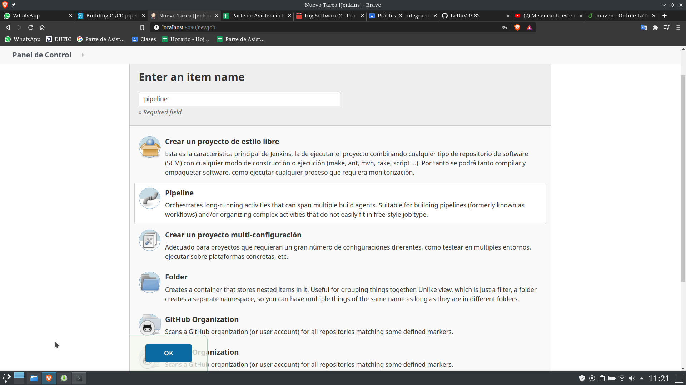
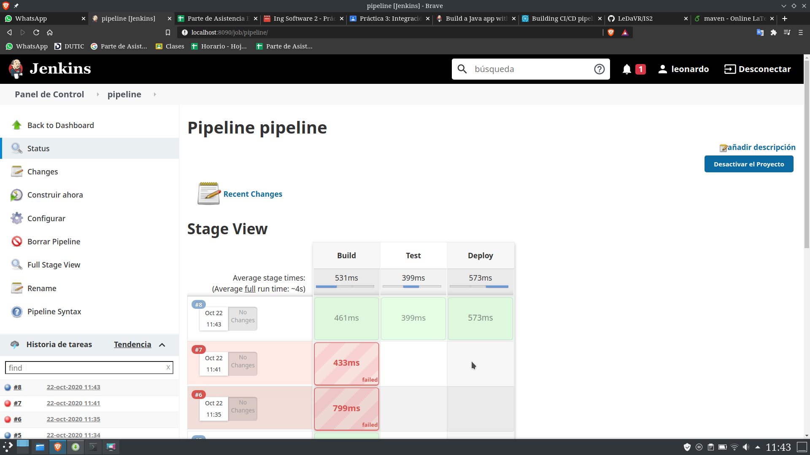

# Práctica jenkins

## creando pipeline
 

## Configuración de pipeline

```
pipeline {
   agent any

   stages {
      stage('Build') {
        steps {
          echo 'Building...'
          echo "Running ${env.BUILD_ID} ${env.BUILD_DISPLAY_NAME} on ${env.NODE_NAME} and JOB ${env.JOB_NAME}"
        }
   }
   stage('Test') {
     steps {
        echo 'Testing...'
     }
   }
   stage('Deploy') {
     steps {
       echo 'Deploying...'
     }
   }
  }
}
 


```
## Ejecución 

 

