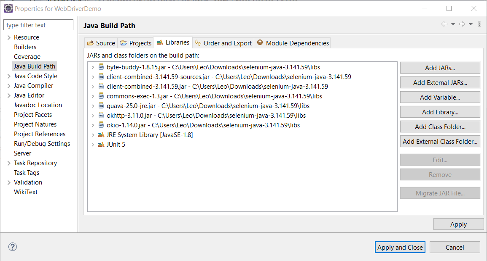
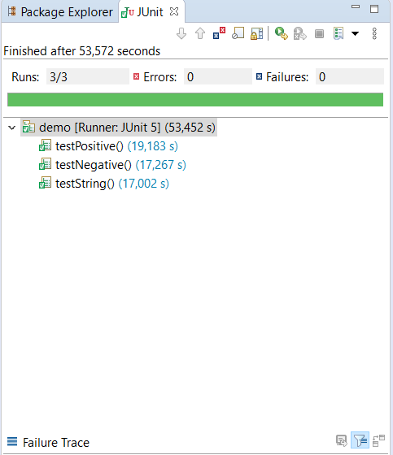

# Selenium y Junit

## Añadimos las librerias externas de junit y selenium



## Añadimos system.setProperty("webdriver.gecko.driver","Directorio de geckodriver")
```java

@Test
   public void test() {
	   System.setProperty("webdriver.gecko.driver","C:\\Users\\Leo\\Downloads\\geckodriver-v0.28.0-win64\\geckodriver.exe");
	      WebDriver driver = new FirefoxDriver();
	      //Puts an Implicit wait, Will wait for 10 seconds before throwing exception
	      driver.manage().timeouts().implicitlyWait(10, TimeUnit.SECONDS);
	      
	      //Launch website
	      driver.navigate().to("http://www.calculator.net/");
	      
	      //Maximize the browser
	      driver.manage().window().maximize();
	      
	      // Click on Math Calculators
	      driver.findElement(By.xpath("//*[@id=\"contentout\"]/table/tbody/tr/td[3]/div[2]/a")).click();
	      
	      // Click on Percent Calculators
	      driver.findElement(By.xpath("//*[@id=\"content\"]/table[2]/tbody/tr/td/div[3]/a")).click();
	      
	      // Enter value 10 in the first number of the percent Calculator
	      driver.findElement(By.id("cpar1")).sendKeys("10");
	      
	      // Enter value 50 in the second number of the percent Calculator
	      driver.findElement(By.id("cpar2")).sendKeys("50");
	      
	      // Click Calculate Button
	      driver.findElement(By.xpath(".//*[@id = 'content']/table/tbody/tr[2]/td/input[2]")).click();

	      
	      // Get the Result Text based on its xpath
	      result =
	         driver.findElement(By.xpath(".//*[@id = 'content']/p[2]/font/b")).getText();

	      //Close the Browser.
	      driver.close();
		assertEquals(result, "5" );
   }

```


## Ejecutamos como junit

